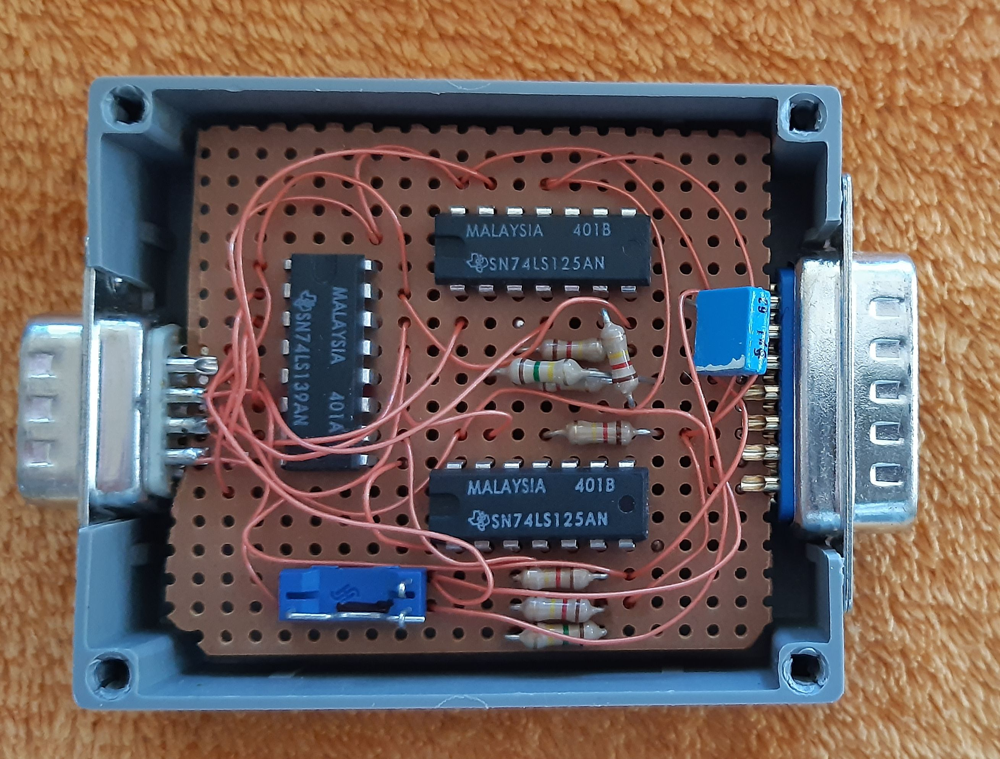
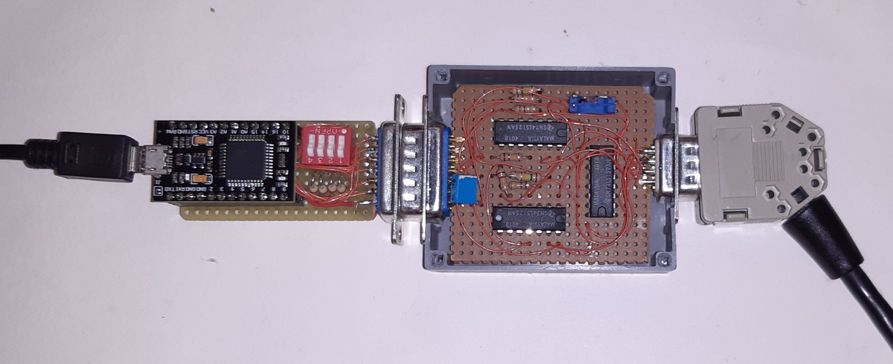

# Joystick-Adapter_9-15

This is a 9 pin Kempston joystick to 15 pin PC GamePort joystick adapter,
I have built this adapter already in 1993, but only now I made a KiCad plan afterwards.

Now you can play old games with an old Kempston joystick (from ZX-Spectrum / C64) via this adapter and your "USB GamePort adapter" under Windows / DOSBox.

- - -
Dieses ist ein 9 Pin Kempston Joystick zu 15 Pin PC GamePort Joystick Adapter, 
ich habe diesen Adapter bereits 1993 bebaut, aber erst jetzt nachträglich einen KiCad Plan erstellt.

Nun können mit einen alten Kempston Joystick (vom ZX-Spectrum / C64) über diesen Adapter und deinen "USB GamePort Adapter" unter Windows / DOSBox alte Spiele gespielt werden.

